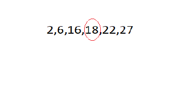
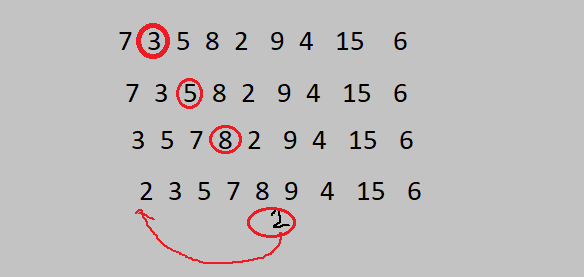

# İnsertion Sort Projesi 

## Proje 1

[22,27,16,2,18,6] -> Insertion Sort

**1.Yukarı verilen dizinin sort türüne göre aşamalarını yazınız.**

1. Dizinin ikinci elemanı  27 başlangıç olarak seçilir.
2. 27 ile 22 kıyaslanır. 27>22'den büyük olduğu için 1 dizimiz 22 olur.
3. 27 ile 16 kontrol edilir. 16<27'den aynı zamanda  16<22'den  ve böylece 16 ilk başa alınır.
4. Bu kısımda dördüncü elemanımız 2 bakıyoruz. İndis değerimiz en küçük olduğu için sol tarafa  ilk baş kısma alıyoruz. 
**2,16,22,27,18,6**
5. İndis değerimiz beştir. Karşılık gelen sayı ise 18'dir. Solundaki 27,22,16,2 ile kontrol edilir. Kendi yerine girerek dizinin son şeklini oluşturur.
**2,16,18,22,27,6**

6. Son adımdayız. Ve bu kısımda son indis değeri olan 6 kontrol edilir. 6<27,6<22,6<18,6<16 kontrolü yapılır. Ve kendi bölümüne girer.Son halini almış olur.
**2,6,16,18,22,27**
---
**2.Big-O gösterimini yazınız.**

---
**3.Dizi sıralandıktan sonra 18 sayısı hangi case kapsamına girer? Yazınız.**

 **Average case: Aradığımız sayının ortada olması**

 ---
 **[7,3,5,8,2,9,4,15,6] dizisinin Insertion Sort'a göre ilk 4 adımını yazınız.**

